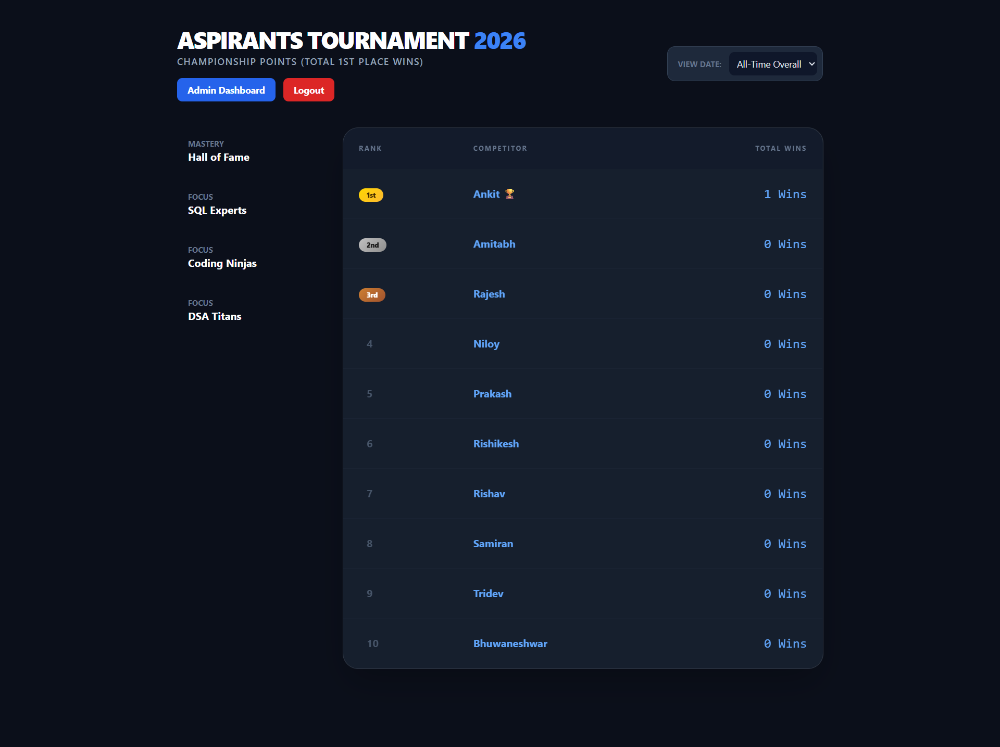
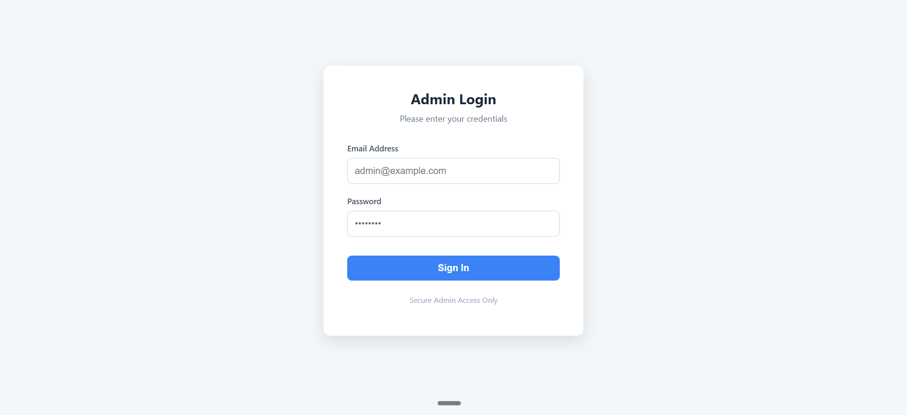
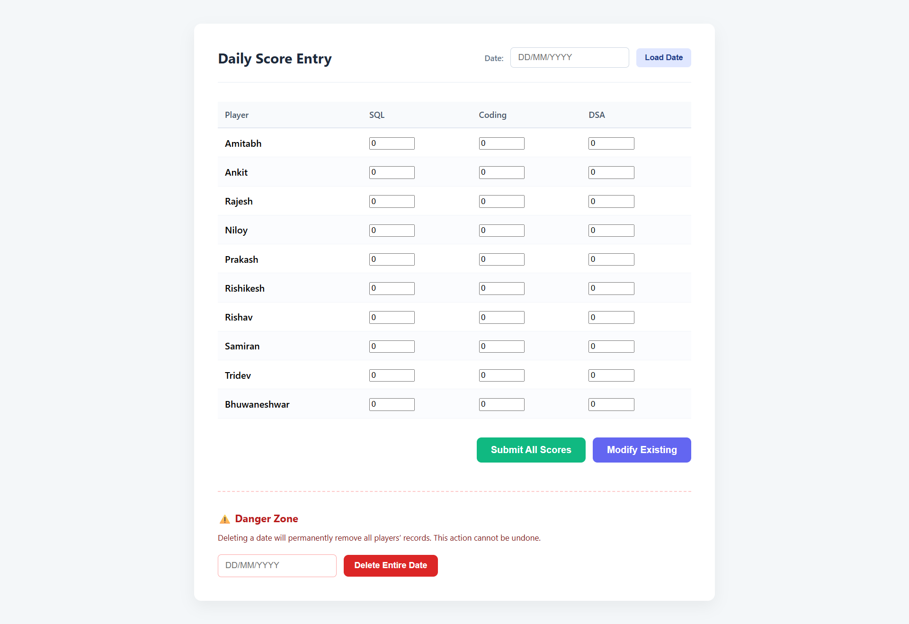
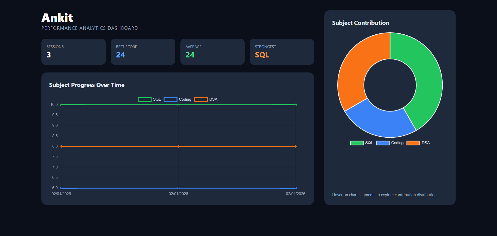

# 🏆 ASPIRANTS Tournament Leaderboard 2026

A full-stack web application to manage and visualize tournament performance with real-time leaderboard updates, admin controls, and player analytics.

---

## 🚀 Live Demo
Frontend: [https://aspirants-score-leaderboard-frontend.vercel.app](https://aspirants-score-leaderboard-frontend.vercel.app) \
Backend: [https://aspirants-score-leaderboard.vercel.app](https://aspirants-score-leaderboard.vercel.app) 

---

## 📌 Overview

This project is a **full-stack leaderboard management system** designed to track and analyze player performance across multiple subjects over time.

It provides:
- Admin-controlled score updates
- Real-time leaderboards
- Player-specific analytics
- Secure authentication

---

## 📸 Screenshots

### 🏆 Leaderboard


### 🔑 Admin Login Page


### 🔐 Admin Dashboard


### 📊 Player Analytics


---

## ✨ Features

### 🔐 Admin System
- Secure login using JWT authentication


### 📊 Score Management
- Upload scores **date-wise**
- Bulk score entry for all players
- Modify existing records for any date
- Delete records (entire date or specific player)

### 🏆 Leaderboard
- Dynamic leaderboard with rankings
- Three subject-specific boards:
  - 🧠 DSA
  - 💻 Coding
  - 🗄 SQL
- Overall leaderboard based on performance
- Rank #1 player is always displayed at the top

### 📅 Date-wise Analysis
- View performance for any specific date
- Compare daily performance vs overall stats

### 👤 Player Analytics
- Individual player statistics
- Historical performance tracking
- Interactive charts for:
  - Subject-wise performance
  - Total scores over time
- Clean and interactive UI


### 🎨 UI/UX
- Modern UI built with Tailwind CSS
- Responsive design
- Clean dashboard experience
- Smooth interactions

---

## 🛠 Tech Stack

### Frontend
- HTML
- Tailwind CSS
- JavaScript (Vanilla JS)
- Chart.js

### Backend
- Node.js
- Express.js

### Database
- MongoDB Atlas

### Authentication
- JWT (JSON Web Tokens)
- bcrypt (password hashing)

### Deployment
- Vercel (Frontend & Backend)
- GitHub (Version Control)

---

## 📂 Project Structure

```plaintext
project-root/
│
├── images/
│   ├── leaderboard.png
│   ├── score-update.png
│   ├── analytics.png
│   └── login.png
|
├── frontend/
│ ├── index.html
│ ├── admin.html
│ ├── admin-dashboard.html
│ ├── player.html
│ └── script.js
│
├── backend/
│ ├── models/
│ │ ├── Player.js
│ │ ├── User.js
│ ├── routes/
│ │ ├── leaderboard.js
│ │ ├── auth.js
│ │
│ ├── middleware/
│ │ └── auth.js
│ │
│ ├── index.js
│ └── createAdmins.js
│
└── README.md
```


---

## 🔑 Environment Variables

Create a `.env` file inside the backend folder:

```plaintext
MONGO_URI=your_mongodb_connection_string
JWT_SECRET=your_secret_key
```

---

## ⚙️ Installation & Setup

### 1️⃣ Clone the repository

```bash
git clone https://github.com/Coder-Ankit-MCA/ASPIRANTS-Leaderboard.git
cd aspirants-leaderboard
```
### 2️⃣ Backend Setup
```bash
cd backend
npm install
```
Create `.env` file and add:
```plaintext
MONGO_URI=your_mongodb_connection_string
JWT_SECRET=your_secret_key
```
Run server:
```bash
node index.js
```
### 3️⃣ Create Admin Users (One-time)
```bash
node createAdmins.js
```

### 4️⃣ Frontend Setup
Open:
```plaintext
frontend/index.html
```
Or use Live Server.
---

## 🔐 Default Admin Credentials

```plaintext
Email: admin@gmail.com
Password: admin123
```
---

## 📊 API Endpoints
Public:
```bash
GET /api/leaderboard
```
Auth:
```bash
POST /api/auth/login
```
Admin (Protected)
```bash
POST /api/leaderboard/bulk-update
PUT  /api/leaderboard/modify-date
DELETE /api/leaderboard/delete-date
GET /api/logs
```

---

## 🧠 Key Concepts Used

- RESTful API design
- JWT authentication
- MongoDB schema design
- Aggregation & data transformation
- Dynamic UI rendering
- Chart visualization
- Role-based access control

---

## 💡 Future Improvements

- Role-based permissions (Admin / Viewer)
- Leaderboard filters (date range, player)
- Dark/Light theme toggle
- Mobile app version

---

## 👨‍💻 Author

### [Ankit Mishra](https://github.com/Coder-Ankit-MCA)

---

## ⭐ Show Your Support

#### If you like this project, give it a ⭐ on GitHub!
